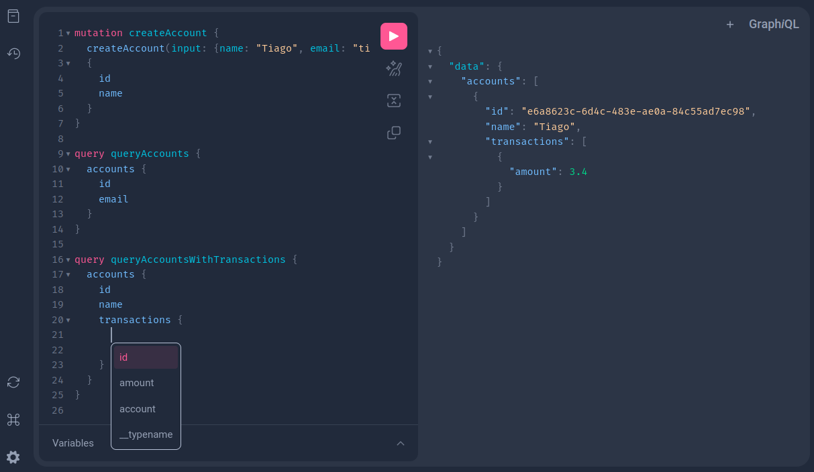

# GraphQL

> Este guia foi elaborado por **Enéas Almeida** com o principal objetivo de facilitar os repasses de informações à equipe.

## O que é o GraphQL

<p align="center"></p>

GraphQL é uma linguagem de consulta de dados e uma runtime para execução dessas consultas, desenvolvida pelo Facebook em 2012 e posteriormente liberada como código aberto em 2015. Ela oferece uma abordagem mais eficiente e flexível para obter e manipular dados em comparação com abordagens tradicionais como REST.

## Onde é ideal utilizar GraphQL

-   **Aplicações com múltiplos clientes**: Quando você tem diferentes clientes (por exemplo, aplicativos móveis, aplicativos da web, dispositivos IoT);

-   **Microserviços**: Em ambientes de microservices, onde há muitos serviços independentes responsáveis por diferentes partes de uma aplicação;

-   **BFF**: Uma excelente escolha para o padrão arquitetural BFF, fornecendo flexibilidade de consultas, redução de chamadas de APIs e desacoplamento cliente-servidor.

## Links importantes

-   [GQLGen](https://gqlgen.com/) - Biblioteca em Go para trabalhar com GraphQL rapidamente.

### Passo 1 - Incializa a estrutra de pastas com os pacotes necessários

```bash
# Incializa o projeto
go mod init graphql

# Cria os diretórios e depedências necessárias
printf '// +build tools\npackage tools\nimport (_ "github.com/99designs/gqlgen"\n _ "github.com/99designs/gqlgen/graphql/introspection")' | gofmt > tools.go

# Baixa os pacotes
go mod tidy
```

### Passo 2 - Inicializa o projeto com o GQLGen

```bash
# Inicializa o GQLGen
go run github.com/99designs/gqlgen init

# Baixa os pacotes
go mod tidy
```

### Passo 3 - Inicializa o servidor

```bash
go run cmd/server/server.go
```

### Passo 4 - Acessa o playground do GraphQL

http://localhost:8080/

## Passo 5 - Altera o schema GraphQL pré definido

```graphql
# Em /graph/schema.graphqls
scalar DateTime

type Transaction {
    id: ID!
    amount: Float!
    account: Account! # Relacionamento 1:1
    createdAt: DateTime!
    updatedAt: DateTime!
}

type Account {
    id: ID!
    name: String!
    email: String!
    transactions: [Transaction!]! # Relacionamento 1:M
    createdAt: DateTime!
    updatedAt: DateTime!
}

input NewTransaction {
    amount: Float!
    accountId: ID!
}

input NewAccount {
    name: String!
    email: String!
}

type Query {
    transactions: [Transaction!]!
    accounts: [Account!]!
}

type Mutation {
    createTransaction(input: NewTransaction!): Transaction!
    createAccount(input: NewAccount!): Account!
}
```

Assim que alterado o schema como demonstrado no código acima, reconfigura o schema através do GQLGen com o comando abaixo:

```bash
go run github.com/99designs/gqlgen generate
```

⚠️ **Atenção**: após gerar o novo schema, lembrar de apagar os resolvers antigos em schema.resolvers.go

### Passo 6 - Separa os models criados, para melhor criar os relacionamentos

Cria os 2 modelos no diretório graph/model:

-   account.go
-   transaction.go

Separa os objetos Account e Transaction que estão dentro de models_gel.go, apenas a struct e coloca nos respectivos arquivos.

No arquivo gqlgen.yml que está na raiz, cria a seguinte estrutruta:

```yml
models:
    Account:
        model:
            - graphql/graph/model.Account
    Transaction:
        model:
            - graphql/graph/model.Transaction
```

Gera novamente as estruturas e dependências:

```bash
go run github.com/99designs/gqlgen generate
```

### Passo 7 - Testando a consulta no Playground

⚠️ **Atenção**: Antes de testar, implementar os métodos, pois, se não implementado, retorna um panic.

http://localhost:8080/



```graphql
# Cria a conta
mutation createAccount {
    createAccount(input: { name: "Tiago", email: "tiago@gmail.com" }) {
        id
        name
    }
}

# Lista as contas
query queryAccounts {
    accounts {
        id
        email
    }
}

# Lista as contas e a lista de transações
query queryAccountsWithTransactions {
    accounts {
        id
        name
        transactions {
            amount
        }
    }
}

# Cria uma transação para uma conta
mutation createTransaction {
    createTransaction(input: { amount: 3.4, accountId: "e6a8623c-6d4c-483e-ae0a-84c55ad7ec98" }) {
        id
    }
}

# Lista todas as transações
query queryTransactions {
    transactions {
        id
        amount
    }
}

# Lista todas as transações e a conta relacionada
query queryTransactionsWithAccount {
    transactions {
        id
        amount
        account {
            name
            email
        }
    }
}
```

## Sqlite3

### Instalação Sqlite3

```bash
# Instalação
sudo apt install sqlite3

# Versão
sqlite3 --version
```

### Comandos Sqlite3

```bash
# Acessa o banco
sqlite3 data.db

# Cria tabela accounts
sqlite> create table accounts (id string, name string, email string);

# Cria a tabela transactions
sqlite> create table transactions (id string, amount decimal, account_id string);

# Lista os dados da tabela
sqlite> select * from accounts;

# Para sair
sqlite> .quit
```

<details>
<summary>Mais comandos do Sqlite3</summary>

```bash
# Deleta todos os registros
sqlite> DELETE FROM accounts;

# Dropa a tabela
sqlite> DROP TABLE accounts;

# Insere um registro na tabela accounts
sqlite> INSERT INTO accounts (id, name, email) VALUES ('xx0011', 'tiago', 'tiago@gmail.com');

# Insere um registro na tabela transactions
sqlite> INSERT INTO transactions (id, amount, account_id) VALUES ('kk0033', 33.20, 'xx0011');
```

</details>

<hr />

<div>
  
  <sub>Made with 💙 by <a href="https://github.com/venzel">Enéas Almeida</a></sub>
</div>
